# Advanced Lane Finding Project

The goals / steps of this project are the following:

* Compute the camera calibration matrix and distortion coefficients given a set of chessboard images.
* Apply a distortion correction to raw images.
* Use color transforms, gradients, etc., to create a thresholded binary image.
* Apply a perspective transform to rectify binary image ("birds-eye view").
* Detect lane pixels and fit to find the lane boundary.
* Determine the curvature of the lane and vehicle position with respect to center.
* Sanity check of detected lines.
* Warp the detected lane boundaries back onto the original image.
* Output visual display of the lane boundaries and numerical estimation of lane curvature and vehicle position.

## Run detector
Detector runs as console application with entry point in [run.py](run.py), which parses CLI arguments, setups detector and run in specified mode.  

```
usage: run.py [-h] [-m MODE] [-i IMAGE] [-v VIDEO] [-f FRAME] [-wt WIDTH] [-ht HEIGHT] [-d]

optional arguments:
  -h, --help                  show this help message and exit
  -m MODE, --mode MODE        Detector mode: image, test-images, video, camera-test
  -i IMAGE, --image IMAGE     Image path for "image" mode
  -v VIDEO, --video VIDEO     Video path for "video" mode
  -f FRAME, --frame FRAME     Video frame time in seconds
  -wt WIDTH, --width WIDTH    Image/frame width in px
  -ht HEIGHT, --height HEIGHT Image/frame height in px
  -d, --debug                 Debug mode
```

Example for image detection: `python3 run.py --width=1280 --height=720 --mode=image --image=test_images/test1.jpg --debug`

Example for video detection: `python3 run.py --width=1280 --height=720 --mode=video --image=project_video`

## Result
### Test images

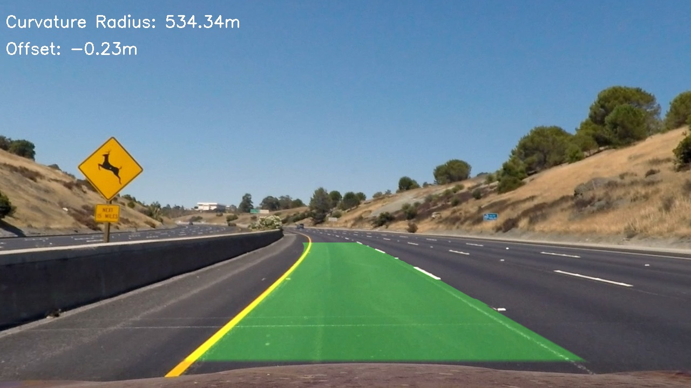
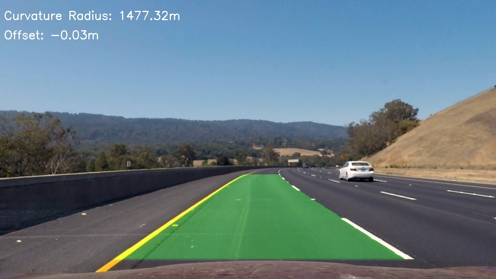
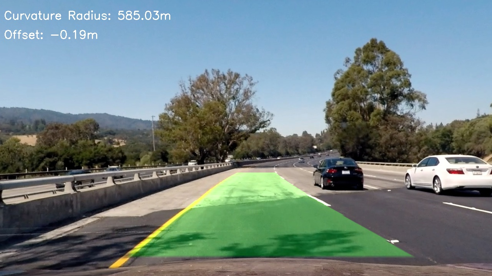
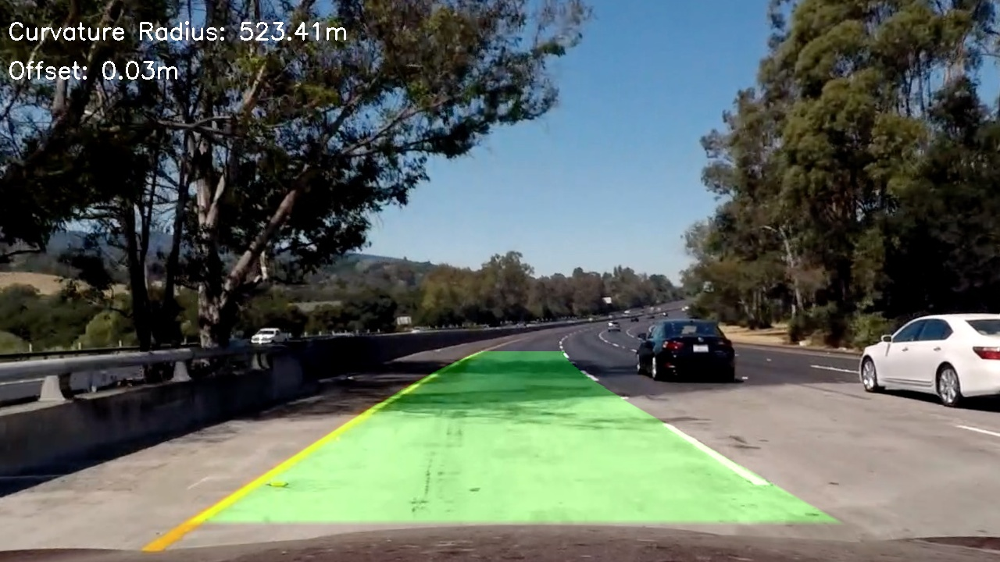
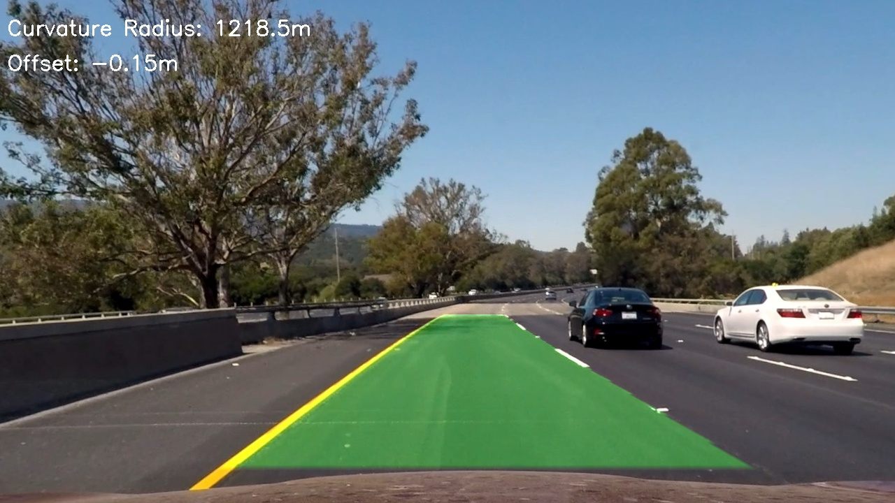
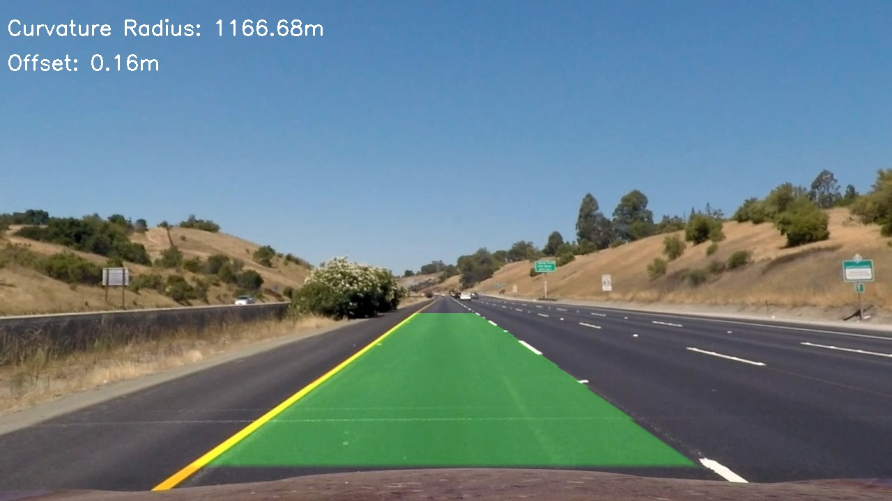
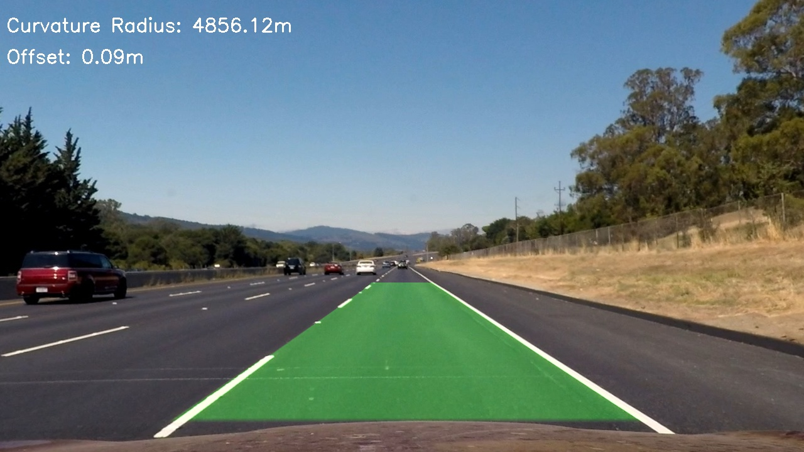

### Test video
[Project Video](output_videos/project_video.mp4)
[Challenge Video](output_videos/challenge_video.mp4)
[Harder Challenge Video](output_videos/challenge_video.mp4)

## Pipeline
### Step 0. Camera Calibration

Camera calibration is required step to get undistorted frames and to build correct perspective transform.

OpenCV function `calibrateCamera()` was used to get camera intrinsic matrix, distortion coefficients.
This function requires preparing "object points", which will be the (x, y, z) coordinates of the chessboard corners in the world (assuming the chessboard is fixed on the (x, y) plane at z=0),
and "image points, which represent corners points on a image side and they were found by OpenCV `findChessboardCorners`.

After getting camera matrix it was refined by OpenCV `getOptimalNewCameraMatrix`.

Camera calibration implemented in [Camera class](detector/camera.py)

### Step 1. Undistort input image 
There are two methods implemented for image undistrortion `undistort` and `undistort2` in [Camera class](detector/camera.py).
 
undistort2 with rectification map technique shows better performance and used in this particular step.

Distorted image:
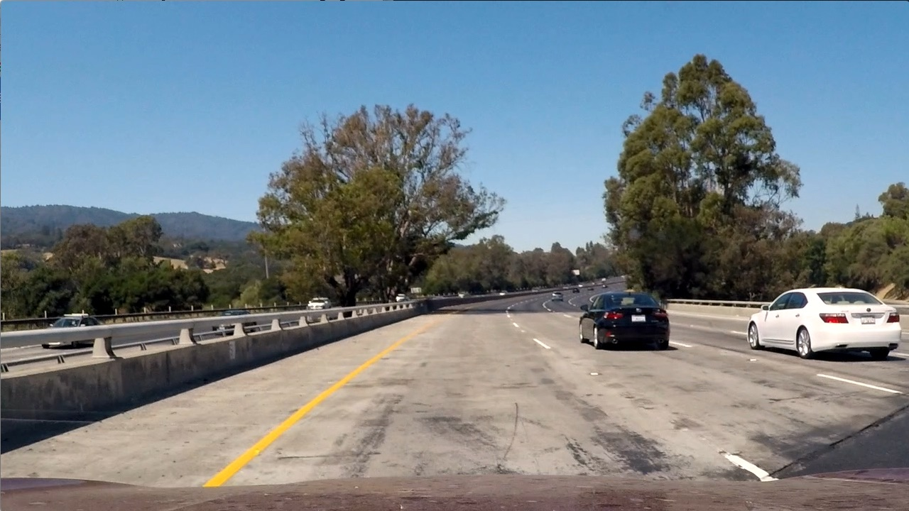

Undistorted image:


### Step 2. Creating a thresholded binary image
The class is responsible for building thresholded binary image is [Detector](detector/detector.py)

Algorithm is implemented in `_get_lane_lines_pixels` function

Extracting lane lines pixels was performed in following steps:
- converting to HSL color scheme
- calculating gradient magnitude and gradient detection on S and L channels
- thresholding by magnitude and direction
- merging results of thresholding on S and L channels

S channel gradient magnitude:


S channel gradient direction:


L channel gradient magnitude:
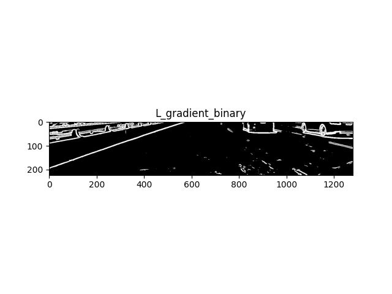

L channel gradient direction:
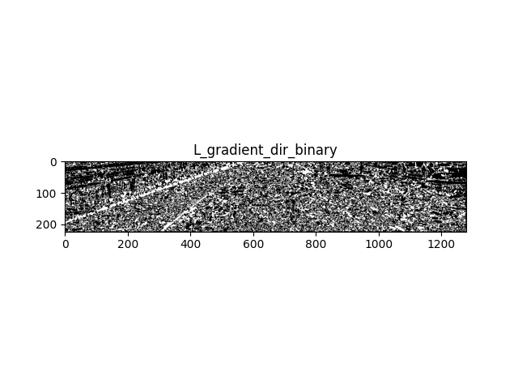

Combined:
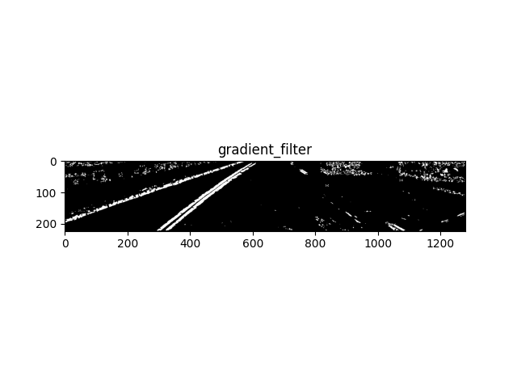

### Step 3. Birds-eye-view
To get birds-eye-view perspective transformation matrix calculation is needed. 

This matrix defined in `calculate_perspective_matrices` function in [Camera](detector/camera.py) class.

Binary thresholded image after perspective transformation:
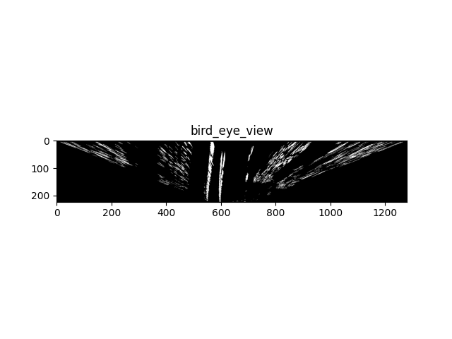

### Lane lines pixels detecting and fitting
Detection and fitting implemented in `_fit_lines` function in `advanced/detector/detector.py:161`
and uses histogram peaks to determine starting positions and sliding window algorithm to detect lines pixels.

Histogram:
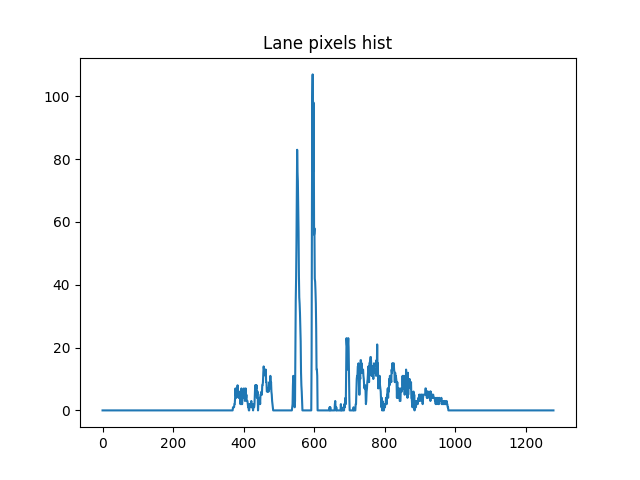

After lines pixels detection 2-nd polynomial fitting is performed:
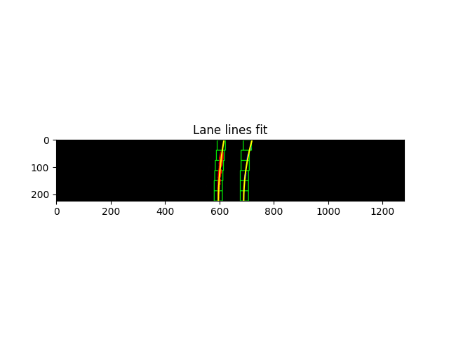

### Step 4. Determine curvatures and ego vehicle offsets

### Step 5. Sanity check

### Step 6. Warping back and output visual information


## Discussion

#### 1. Briefly discuss any problems / issues you faced in your implementation of this project.  Where will your pipeline likely fail?  What could you do to make it more robust?

Here I'll talk about the approach I took, what techniques I used, what worked and why, where the pipeline might fail and how I might improve it if I were going to pursue this project further.  
