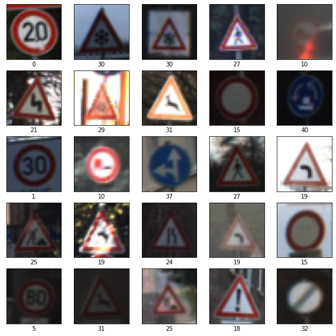
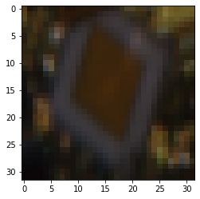
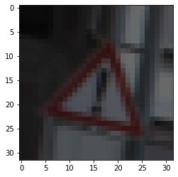
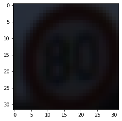
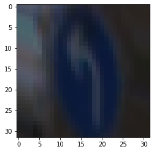
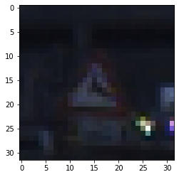
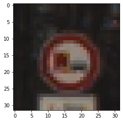
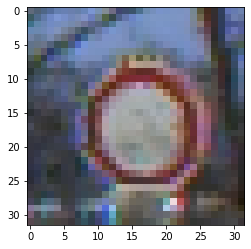

## Project: Build a Traffic Sign Recognition Program
[](http://www.udacity.com/drive)

In this project, you will use what you've learned about deep neural networks and convolutional neural networks to classify traffic signs. You will train and validate a model so it can classify traffic sign images using the [German Traffic Sign Dataset](http://benchmark.ini.rub.de/?section=gtsrb&subsection=dataset). After the model is trained, you will then try out your model on images of German traffic signs that you find on the web.

The goals / steps of this project are the following:
* Load the data set
* Explore, summarize and visualize the data set
* Design, train and test a model architecture
* Use the model to make predictions on new images
* Analyze the softmax probabilities of the new images
* Summarize the results with a written report


### Dependencies
This lab requires:

* [CarND Term1 Starter Kit](https://github.com/udacity/CarND-Term1-Starter-Kit)

The lab environment can be created with CarND Term1 Starter Kit. Click [here](https://github.com/udacity/CarND-Term1-Starter-Kit/blob/master/README.md) for the details.


### Run

1. Download the [data set](https://s3-us-west-1.amazonaws.com/udacity-selfdrivingcar/traffic-signs-data.zip) and put test.p, train.p, valid.p from archive to ./data directory
2. Run [Traffic_Sign_Classifier.ipynb](Traffic_Sign_Classifier.ipynb)
```sh
jupyter notebook Traffic_Sign_Classifier.ipynb
```
3. Example of executed notebook can be found at [Traffic_Sign_Classifier.html](Traffic_Sign_Classifier.html) 


### Data Set Summary & Exploration

Datasets for train, validation and validation can be found at https://s3-us-west-1.amazonaws.com/udacity-selfdrivingcar/traffic-signs-data.zip

#### Datasets statistics
```text
Number of training examples   = 34 799 (67.12899554389553%)
Number of validation examples = 4410 (8.507108547618587%)
Number of testing examples    = 12 630 (24.36389590848589%)
Image data shape              = (32, 32, 3)
Number of classes             = 43
```

Training dataset contains traffic signs from variety of distances, lightning conditions and it is very disbalanced. 

Class frequencies (count of samples per class):
```text
0   -  180 (0.52%)
1   -  1980 (5.69%)
2   -  2010 (5.78%)
3   -  1260 (3.62%)
4   -  1770 (5.09%)
5   -  1650 (4.74%)
6   -  360 (1.03%)
7   -  1290 (3.71%)
8   -  1260 (3.62%)
9   -  1320 (3.79%)
10  -  1800 (5.17%)
11  -  1170 (3.36%)
12  -  1890 (5.43%)
13  -  1920 (5.52%)
14  -  690 (1.98%)
15  -  540 (1.55%)
16  -  360 (1.03%)
17  -  990 (2.84%)
18  -  1080 (3.1%)
19  -  180 (0.52%)
20  -  300 (0.86%)
21  -  270 (0.78%)
22  -  330 (0.95%)
23  -  450 (1.29%)
24  -  240 (0.69%)
25  -  1350 (3.88%)
26  -  540 (1.55%)
27  -  210 (0.6%)
28  -  480 (1.38%)
29  -  240 (0.69%)
30  -  390 (1.12%)
31  -  690 (1.98%)
32  -  210 (0.6%)
33  -  599 (1.72%)
34  -  360 (1.03%)
35  -  1080 (3.1%)
36  -  330 (0.95%)
37  -  180 (0.52%)
38  -  1860 (5.34%)
39  -  270 (0.78%)
40  -  300 (0.86%)
41  -  210 (0.6%)
42  -  210 (0.6%)
```

Classes Examples (class ID displayed under image):



### Design and Test a Model Architecture

Since training data is highly disbalanced some augmented data was generated by [ImageDataGenerator](https://keras.io/preprocessing/image/) and appended to training dataset. 
Augmentation performed by randomly sampling data from source images with rotation, shear, zoom transformations. 

There are two methods of augmentation were tested: 
* "full balance method" - algorithm tries to add images for each class to retrieve equally distributed samples
*  simpler approach - generates some percent of train images count of random samples and random classes

After testing simpler approach was taken. 
It seams like in full balanced method count of synthetic data is greater than real data and model performs worse on validation set.

#### Augmentation Examples





#### Dataset after augmentation
```text
Frequencies:
0   -  345 (0.55%)
1   -  3538 (5.65%)
2   -  3571 (5.7%)
3   -  2255 (3.6%)
4   -  3206 (5.12%)
5   -  3002 (4.79%)
6   -  640 (1.02%)
7   -  2346 (3.75%)
8   -  2268 (3.62%)
9   -  2399 (3.83%)
10  -  3311 (5.29%)
11  -  2152 (3.44%)
12  -  3439 (5.49%)
13  -  3436 (5.49%)
14  -  1224 (1.95%)
15  -  989 (1.58%)
16  -  658 (1.05%)
17  -  1729 (2.76%)
18  -  1929 (3.08%)
19  -  341 (0.54%)
20  -  534 (0.85%)
21  -  486 (0.78%)
22  -  563 (0.9%)
23  -  827 (1.32%)
24  -  455 (0.73%)
25  -  2406 (3.84%)
26  -  930 (1.48%)
27  -  385 (0.61%)
28  -  861 (1.37%)
29  -  423 (0.68%)
30  -  702 (1.12%)
31  -  1243 (1.98%)
32  -  375 (0.6%)
33  -  1085 (1.73%)
34  -  644 (1.03%)
35  -  1918 (3.06%)
36  -  611 (0.98%)
37  -  308 (0.49%)
38  -  3343 (5.34%)
39  -  508 (0.81%)
40  -  518 (0.83%)
41  -  353 (0.56%)
42  -  382 (0.61%)
```

#### Model Architecture
Model architecture based on LeNet

| Layer         		|     Description	        					| 
|:---------------------:|:---------------------------------------------:| 
| Input         		| 32x32x3 RGB image   							| 
| Convolution 1 5x5    	| 1x1 stride, valid padding, outputs 28x28x6 	|
| ReLU					|												|
| Max pooling	      	| 2x2 stride,  outputs 14x14x6   				|
| Convolution 2 5x5    	| 1x1 stride, valid padding, outputs 10x10x16 	|
| ReLU					|												|
| Max pooling	      	| 2x2 stride,  outputs 5x5x16   				|
| Dense Layer 1      	| Input 400 = 5*5 *16, outputs 120				|
| Dropout   	      	| Rate 0.2, probability 0.8        				|
| Dense Layer 2	      	| Input 96 = 0.8*120, outputs 84   				|
| Dropout   	      	| Rate 0.2, probability 0.8        				|
| Dense Layer 3	      	| Input 67 = 0.8*84, outputs 43    				|
| Softmax               |                                               |

#### Model Training

To train the model cross entropy was optimized by Adam optimizer with learning rate 0.001, batch size 80 and epochs count equal to 20.

My final model results were:
* training set accuracy of 0.978
* validation set accuracy of 0.936 
* test set accuracy of 0.920

To achieve this results to original LeNet architecture were added dropouts stages after dense layers and epochs count was increased from 10 to 20
and batch size reduced to 80. Tuning learning rate usually led to worse performance.
Also data normalization and augmentation increases accuracy from 0.8 to 0.9.


### Test a Model on New Images  

For real-world testing [GTSRB_Online-Test-Images.zip](https://sid.erda.dk/public/archives/daaeac0d7ce1152aea9b61d9f1e19370/GTSRB_Online-Test-Images.zip) dataset was downloaded from https://sid.erda.dk/public/archives/daaeac0d7ce1152aea9b61d9f1e19370/published-archive.html and
simple samples generator was written, which searches 32x32 images from random classes.





The first image might be difficult to classify because of poor quality and even human can not tell precisely class of sign.

| Image			                                |     Prediction                                | Probabilities	    	                         | 
|:---------------------------------------------:|:---------------------------------------------:|:----------------------------------------------:| 
| 16 - Vehicles over 3.5 metric tons prohibited	| 16 - Vehicles over 3.5 metric tons prohibited | 16 - 1.0, 0 - 0.0, 1 - 0.0, 2 - 0.0, 3 - 0.0   | 
| 4 - Speed limit (70km/h)                  	| 4 - Speed limit (70km/h)                      | 4 - 1.0, 0 - 0.0, 1 - 0.0, 2 - 0.0, 3 - 0.0    | 
| 31 - Wild animals crossing                 	| 23 - Slippery road                            | 23 - 1.0, 31 - 0.0, 1 - 0.0, 2 - 0.0, 3 - 0.0  | 
| 38 - Keep right                           	| 38 - Keep right                               | 38 - 1.0, 0 - 0.0, 1 - 0.0, 2 - 0.0, 3 - 0.0   | 
| 33 - Turn right ahead                        	| 33 - Turn right ahead                         | 33 - 1.0, 0 - 0.0, 1 - 0.0, 2 - 0.0, 3 - 0.0   | 

  
  


